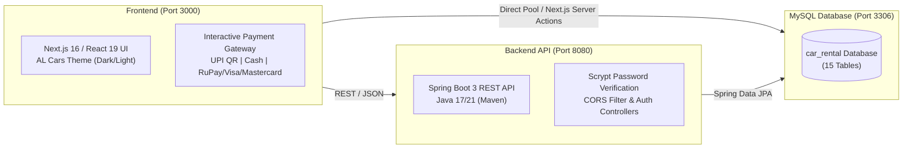

# 🚗 AL Cars — Full Stack Enterprise Vehicle Rental Platform

> **Brand Tagline**: *"YOUR JOURNEY, YOUR CAR, YOUR WAY."*  
> **Clean Monorepo Architecture**: Clean separation of **`frontend/`**, **`backend/`**, and **`database/`**.

---

## 📁 Project Directory Structure

```
D:\CAR_RENTAL\
│
├── 📂 database/                    # All SQL Schemas, Migrations & Seed Data
│   ├── 01_create_database.sql      # Database creation & user grants (pass: 1234)
│   ├── 02_schema_core_tables.sql   # Core tables (users, cars, bookings)
│   ├── 03_schema_expanded_tables.sql # 12 expanded enterprise tables
│   ├── 04_seed_all_data.sql        # Comprehensive sample data for all 15 tables
│   └── 05_all_in_one_master.sql    # ⚡ 1-Click Master SQL Setup
│
├── 📂 backend/                     # Spring Boot 3 Java Enterprise REST API
│   ├── src/main/java/com/carrental/backend/
│   │   ├── config/                 # CORS & Security configuration
│   │   ├── controller/             # Auth, Car & Booking REST Controllers
│   │   ├── dto/                    # Request & Response data transfer objects
│   │   ├── model/                  # JPA Entities (User, Car, Booking)
│   │   ├── repository/             # Spring Data JPA repositories
│   │   ├── service/                # Business logic services
│   │   └── util/                   # Password encryption (scrypt) & helpers
│   ├── src/main/resources/
│   │   └── application.properties  # Server port 8080 & MySQL (pass: 1234) config
│   ├── pom.xml                     # Maven dependencies
│   ├── mvnw & mvnw.cmd             # Maven wrapper scripts
│   └── run.bat / run.ps1           # 1-Click backend launcher scripts
│
├── 📂 frontend/                    # Next.js 16 (App Router) + React 19 + TypeScript
│   ├── app/
│   │   ├── page.tsx                # AL Cars Interactive Login with Live Slogan Pill
│   │   ├── signup/page.tsx         # Account Registration (with letters-only validation)
│   │   ├── cars/page.tsx           # Customer & Guest Vehicle Fleet Showcase
│   │   ├── admin/page.tsx          # Admin Control Center with inline table editing
│   │   ├── booking/page.tsx        # Booking planner with past-date validation
│   │   ├── payment/page.tsx        # Multi-gateway (UPI QR Scanner, Cash, RuPay/Visa/Mastercard)
│   │   ├── api/                    # Serverless API endpoints & auth sessions
│   │   └── globalss.css            # Complete modern design system (Light & Dark themes)
│   ├── public/                     # High-res car fleet photos & AL Cars Phoenix logos
│   ├── lib/                        # Client/server database & session utilities
│   ├── .env.local                  # Environment variables & database URL
│   ├── package.json                # Frontend dependencies
│   └── tsconfig.json               # TypeScript configuration
│
└── 📄 README.md                    # System architecture & operations guide
```

---

## 🏛️ System Architecture



---

## 🔑 Default Credentials

| Account Role | Username | Password | Access Level |
|---|---|---|---|
| **Admin** | `admin` | `admin` | Full control: Add, edit prices/specs, delete cars, manage users |
| **Demo User** | `ajay` | `ajay` | Customer booking, car fleet view, payment gateway |
| **Guest Mode** | *(No login)* | *(Click 'Continue as Guest')* | Browse car fleet & specifications |

---

## 🚀 Step-by-Step Setup & Run Guide

### 1️⃣ Database Setup (MySQL)
- **Host**: `localhost:3306`
- **Database Name**: `car_rental`
- **MySQL Password**: `1234`

Open MySQL Workbench or your terminal, and execute the 1-click master script:
```sql
-- Run file in MySQL:
SOURCE D:/CAR_RENTAL/database/05_all_in_one_master.sql;
```

---

### 2️⃣ Backend Startup (Spring Boot)
Open a terminal in the `backend/` directory:
```powershell
cd D:\CAR_RENTAL\backend

# Run with Maven Wrapper:
.\mvnw.cmd spring-boot:run
```
*The Spring Boot server will start on **`http://localhost:8080`**.*

---

### 3️⃣ Frontend Startup (Next.js)
Open a second terminal in the `frontend/` directory:
```powershell
cd D:\CAR_RENTAL\frontend

# Start the development server:
npm run dev
```
*The Next.js application will open on **`http://localhost:3000`**.*

---

## 📊 Database Schema (15 Tables Overview)

| # | Table Name | Key Columns | Purpose |
|---|---|---|---|
| 1 | `users` | `id`, `username`, `password_hash`, `role` | Authentication & role management |
| 2 | `cars` | `id`, `name`, `price`, `image`, `mileage`, `seats`, `rating` | Available vehicle fleet |
| 3 | `bookings` | `id`, `user_id`, `total_amount`, `pickup_date`, `return_date`, `status` | Booking lifecycle |
| 4 | `customer_profiles` | `id`, `user_id`, `full_name`, `driving_license_no`, `city` | KYC & license records |
| 5 | `car_categories` | `id`, `category_name`, `security_deposit` | Sedans, SUVs, Luxury, EVs |
| 6 | `car_features` | `id`, `feature_name`, `icon` | Sunroof, GPS, 360 Cam, Cruise Control |
| 7 | `car_feature_mappings` | `id`, `car_id`, `feature_id` | Junction linking features to cars |
| 8 | `rental_locations` | `id`, `branch_name`, `city`, `is_airport_hub` | Airport & city branch hubs |
| 9 | `drivers` | `id`, `driver_name`, `license_number`, `daily_rate` | Chauffeurs available for hire |
| 10 | `insurance_plans` | `id`, `plan_name`, `coverage_type`, `daily_price` | Basic, Comprehensive, Zero-Dep |
| 11 | `discount_coupons` | `id`, `coupon_code`, `discount_percentage`, `valid_until` | Promotional discount vouchers |
| 12 | `payments` | `id`, `booking_id`, `amount`, `payment_method`, `transaction_ref` | Financial audit ledger |
| 13 | `reviews_ratings` | `id`, `booking_id`, `car_id`, `rating`, `review_comment` | Verified customer reviews |
| 14 | `car_maintenance` | `id`, `car_id`, `service_type`, `odometer_reading`, `cost` | Vehicle service & health logs |
| 15 | `damage_reports` | `id`, `booking_id`, `car_id`, `repair_cost`, `settlement_status` | Return inspection & deposit claim |

---

## 🌟 Key Application Features

1. **Brand Identity**: **AL Cars** with Phoenix car emblem logo, left-aligned header branding, and tagline: *"YOUR JOURNEY, YOUR CAR, YOUR WAY."*
2. **Interactive Slogan Banner**: Auto-rotating luxury slogan pill (clickable to cycle on login page).
3. **Smart Input Validation**: Real-time blocking of numbers in Name fields (letters only permitted).
4. **Date Integrity**: Past dates blocked (`min=today`), Return date must be on or after Pickup date.
5. **Interactive Payment Gateway**:
   - 📱 **UPI / QR**: Live QR code with scanning laser animation, 1-click copy `alcars@upi`, session timer, and VPA verification.
   - 💵 **Cash on Pickup**: Transparent handover summary with guidelines checklist & instant order confirmation.
   - 💳 **Credit / Debit Cards**: **RuPay 🇮🇳**, **Visa 💳**, and **Mastercard 🔴🟡** selector with dynamic 3D virtual card preview that updates card number, name, and expiration date live.
6. **Admin Control Center**: Inline editing of vehicle prices and specs directly inside the table, instant car creation, and vehicle deletion.

